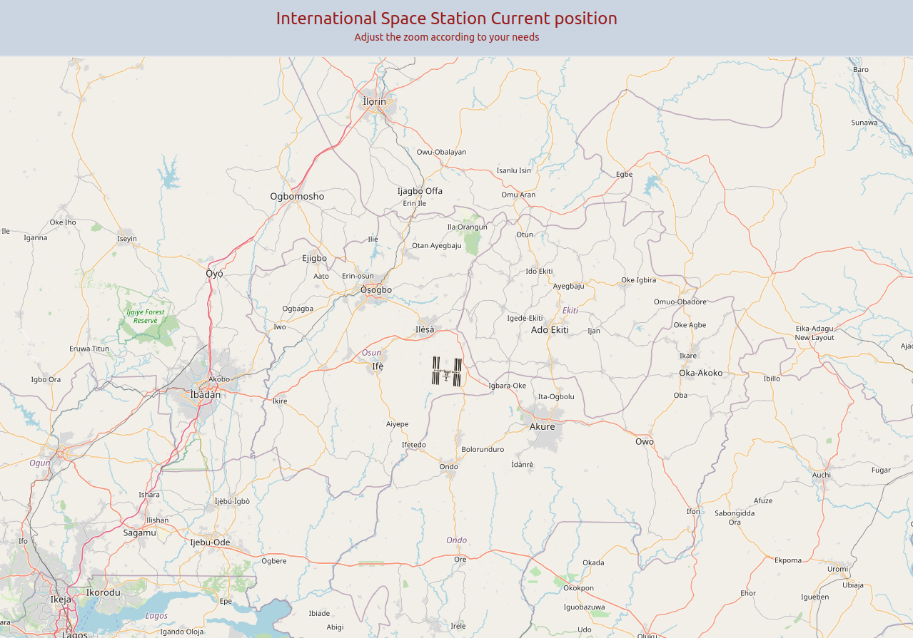

<h1 style="text-align: center;">Current Position of International Space Station</h1>

The purpose of this app is the display the current position of the international space station over the world by using the API. I have used leaflet and openstreetmap in this project.
For styling I have used TailwindCSS.

